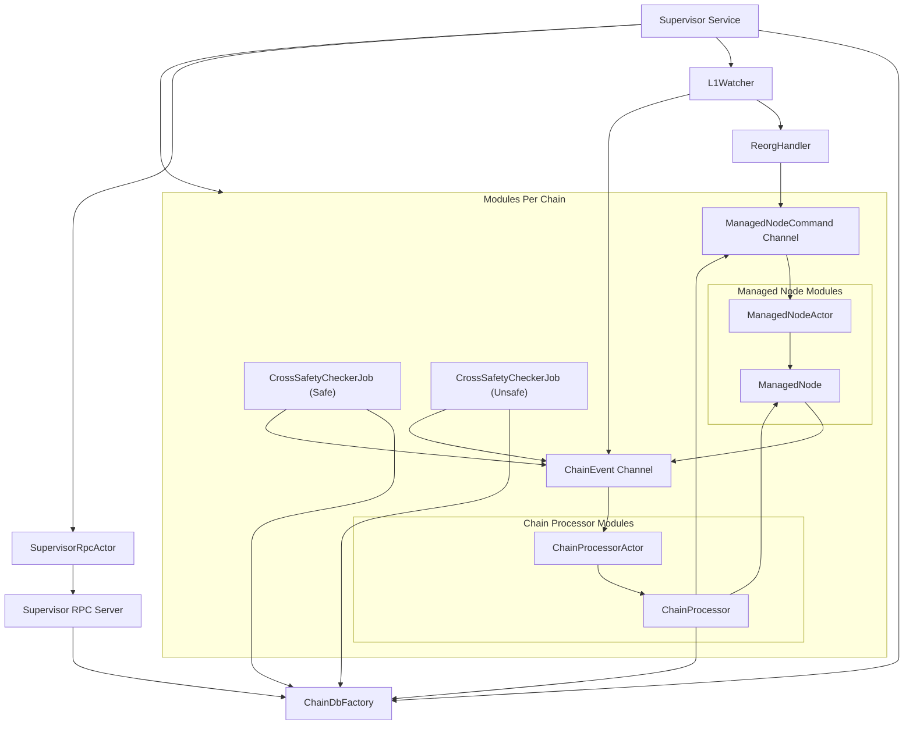

# Kona Supervisor System Architecture

## System Module Diagram

---

## Module Descriptions

### **Global Modules**

- **Supervisor Service (`SVC`)**  
  The main orchestrator. Initializes, manages, and coordinates all subsystems and per-chain modules.

- **ChainDbFactory (`DBF`)**  
  Responsible for creating and managing per-chain databases, providing storage and state management.

- **L1Watcher (`L1W`)**  
  Monitors the Layer 1 chain for finalized and new blocks, detects reorgs and broadcasts relevant events.

- **ReorgHandler (`RH`)**  
  Handles chain reorganizations detected by the L1Watcher, ensuring system consistency.

- **SupervisorRpcActor (`SRPC`)**  
  Exposes the supervisor’s API endpoints for external control and monitoring.

- **Supervisor RPC Server (`SRPCS`)**  
  The actual RPC server implementation, serving requests and interacting with the supervisor service and database.

---

### **Per-Chain Modules**

- **Managed Node Modules**
  - **ManagedNode (`MNODE`)**  
    Represents a node for a specific chain, handling chain-specific logic and state.
  - **ManagedNodeActor (`MN`)**  
    The actor responsible for executing commands and managing the lifecycle of the ManagedNode.

- **Chain Processor modules**
  - **ChainProcessorActor (`CPA`)**  
    Listens for chain events and delegates processing to the ChainProcessor.
  - **ChainProcessor (`CP`)**  
    Processes chain events, interacts with the ManagedNode and ChainDbFactory, and issues commands.

- **CrossSafetyCheckerJob (Safe/Unsafe) (`CSCJ_SAFE`, `CSCJ_UNSAFE`)**  
  Periodically promotes safety levels for each chain, ensuring cross-chain consistency.

- **ChainEvent Channel (`CHAN`)**  
  Event bus for chain events. Receives events from producers (ManagedNode, L1Watcher, CrossSafetyCheckerJobs) and delivers them to the ChainProcessorActor.

- **ManagedNodeCommand Channel (`CMDCHAN`)**  
  Command bus for ManagedNode commands. Receives commands from ChainProcessor and ReorgHandler, and delivers them to ManagedNodeActor.

---

## **Event and Command Flow**

- **Chain events** are produced by ManagedNode, L1Watcher, and CrossSafetyCheckerJobs, sent to the ChainEvent Channel, and consumed by ChainProcessorActor.
- **ManagedNode commands** are produced by ChainProcessor and ReorgHandler, sent to the ManagedNodeCommand Channel, and consumed by ManagedNodeActor.

---

## **Summary**

This architecture provides a modular, event-driven system for managing multiple chains, ensuring robust coordination, safety, and extensibility.  
Each module is clearly separated, with explicit channels for event and command communication, making the system easy to reason about and maintain.
