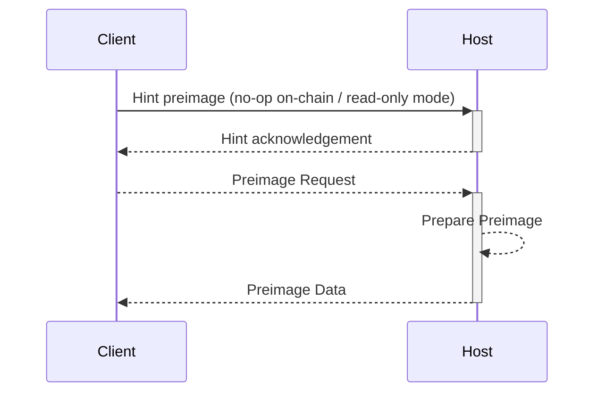

# FPVM Backend

> 📖 Before reading this section of the book, it is advised to read the [Fault Proof Program Environment](/sdk/fpp-dev/env)
> section to familiarize yourself with the PreimageOracle IO pattern.

Kona is effectively split into three parts:

- OP Stack state transition logic (`kona-derive`, `kona-executor`, `kona-mpt`)
- OP Stack state transition proof SDK (`kona-preimage`, `kona-proof`)
- [Fault Proof VM](/glossary#fault-proof-vm) IO and utilities
  (`kona-std-fpvm`, `kona-std-fpvm-proc`)

This section of the book focuses on the usage of `kona-std-fpvm` and `kona-preimage` to facilitate communication between host and client
for programs running on top of the [FPVM targets](/sdk/fpp-dev/env).

## Host and Client Communication API

The FPVM system API is built on several layers. In this document, we'll cover these layers, from lowest-level to
highest-level API.

### `kona-std-fpvm`

`kona-std-fpvm` implements raw syscall dispatch, a default global memory allocator, and a blocking async runtime.
`kona-std-fpvm` relies on a minimal linux backend to function, supporting only the syscalls required to implement the
[PreimageOracle ABI][preimage-specs] (`read`, `write`, `exit_group`).

These syscalls are exposed to the user through the `io` module directly, with each supported platform implementing the
[`BasicKernelInterface`](https://docs.rs/kona-std-fpvm/latest/kona_std_fpvm/trait.BasicKernelInterface.html) trait.

To directly dispatch these syscalls, the [`io`](https://docs.rs/kona-std-fpvm/latest/kona_std_fpvm/io/index.html) module
exposes a safe API:

```rust
use kona_std_fpvm::{io, FileDescriptor};

// Print to `stdout`. Infallible, will panic if dispatch fails.
io::print("Hello, world!");

// Print to `stderr`. Infallible, will panic if dispatch fails.
io::print_err("Goodbye, world!");

// Read from or write to a specified file descriptor. Returns a result with the
// return value or syscall errno.
let _ = io::write(FileDescriptor::StdOut, "Hello, world!".as_bytes());
let mut buf = Vec::with_capacity(8);
let _ = io::read(FileDescriptor::StdIn, buf.as_mut_slice());

// Exit the program with a specified exit code.
io::exit(0);
```

With this library, you can implement a custom communication protocol between the host and client, or extend the existing
[PreimageOracle ABI][preimage-specs]. However, for most developers, we recommend sticking with `kona-preimage`
when developing programs that target the [FPVMs](/sdk/fpp-dev/env), barring needs like printing directly to
`stdout`.

### `kona-preimage`

`kona-preimage` is an implementation of the [PreimageOracle ABI][preimage-specs]. This crate enables synchronous
communication between the host and client program, described in
[Host - Client Communication](/sdk/fpp-dev/env#host---client-communication) in the FPP Dev environment section of the
book.

The crate is built around the [`Channel`](https://docs.rs/kona-preimage/latest/kona_preimage/trait.Channel.html) trait,
which serves as a single end of a bidirectional pipe (see: [`pipe` manpage](https://man7.org/linux/man-pages/man2/pipe.2.html)).

Through this handle, the higher-level constructs can read and write data to the counterparty holding on to the other end
of the channel, following the protocol below:

<center>



</center>

The interfaces of each part of the above protocol are described by the following traits:

- [`PreimageOracleClient`](https://docs.rs/kona-preimage/latest/kona_preimage/trait.PreimageOracleClient.html)
  - To-spec implementation: [`OracleReader`](https://docs.rs/kona-preimage/latest/kona_preimage/struct.OracleReader.html)
- [`HintWriterClient`](https://docs.rs/kona-preimage/latest/kona_preimage/trait.HintWriterClient.html)
  - To-spec implementation: [`HintWriter`](https://docs.rs/kona-preimage/latest/kona_preimage/struct.HintWriter.html)
- [`PreimageOracleServer`](https://docs.rs/kona-preimage/latest/kona_preimage/trait.PreimageOracleServer.html)
  - To-spec implementation: [`OracleServer`](https://docs.rs/kona-preimage/latest/kona_preimage/struct.OracleServer.html)
- [`HintReaderServer`](https://docs.rs/kona-preimage/latest/kona_preimage/trait.HintReaderServer.html)
  - To-spec implementation: [`HintReader`](https://docs.rs/kona-preimage/latest/kona_preimage/struct.HintReader.html)

Each of these traits, however, can be re-implemented to redefine the communication protocol between the host and client if the needs
of the consumer are not covered by the to-[spec][preimage-specs] implementations.

### `kona-proof` - Oracle-backed sources (example)

Finally, in `kona-proof`, implementations of data source traits from `kona-derive` and `kona-executor` are provided
to pull in untyped data from the host by `PreimageKey`. These data source traits are covered in more detail within
the [Custom Backend](/sdk/proof/custom-backend) section, but we'll quickly gloss over them here to build intuition.

Let's take, for example, [`OracleL1ChainProvider`](https://github.com/op-rs/kona/blob/40a8d7ec3def4a1eeb26492a1e4338d8b032e428/bin/client/src/l1/chain_provider.rs#L16-L23).
The [`ChainProvider`](https://docs.rs/kona-derive/latest/kona_derive/trait.ChainProvider.html) trait in `kona-derive`
defines a simple interface for fetching information about the L1 chain. In the `OracleL1ChainProvider`, this information
is pulled in over the [PreimageOracle ABI][preimage-specs]. There are many other examples of these data source traits,
namely the `L2ChainProvider`, `BlobProvider`, `TrieProvider`, and `TrieHinter`, which enable the creation of different
data-source backends.

As an example, let's look at `OracleL1ChainProvider::header_by_hash`, built on top of the `CommsClient` trait, which
is a composition trait of the `PreimageOracleClient + HintReaderServer` traits outlined above.

```rust
#[async_trait]
impl<T: CommsClient + Sync + Send> ChainProvider for OracleL1ChainProvider<T> {
    type Error = anyhow::Error;

    async fn header_by_hash(&mut self, hash: B256) -> Result<Header> {
        // Send a hint for the block header.
        self.oracle.write(&HintType::L1BlockHeader.encode_with(&[hash.as_ref()])).await?;

        // Fetch the header RLP from the oracle.
        let header_rlp =
            self.oracle.get(PreimageKey::new(*hash, PreimageKeyType::Keccak256)).await?;

        // Decode the header RLP into a Header.
        Header::decode(&mut header_rlp.as_slice())
            .map_err(|e| anyhow!("Failed to decode header RLP: {e}"))
    }

    // - snip -
}
```

In `header_by_hash`, we use the inner `HintWriter` to send a hint to the host to prepare the block hash preimage.
Then, once we've received an acknowledgement from the host that the preimage has been prepared, we reach out for
the RLP (which is the preimage of the hash). After the RLP is received, we decode the `Header` type, and return
it to the user.

[op-stack]: https://github.com/ethereum-optimism/optimism
[op-program]: https://github.com/ethereum-optimism/optimism/tree/develop/op-program
[cannon]: https://github.com/ethereum-optimism/optimism/tree/develop/cannon
[cannon-rs]: https://github.com/op-rs/cannon-rs
[asterisc]: https://github.com/ethereum-optimism/asterisc
[fp-specs]: https://specs.optimism.io/experimental/fault-proof/index.html
[fpp-specs]: https://specs.optimism.io/experimental/fault-proof/index.html#fault-proof-program
[preimage-specs]: https://specs.optimism.io/experimental/fault-proof/index.html#pre-image-oracle
[cannon-specs]: https://specs.optimism.io/experimental/fault-proof/cannon-fault-proof-vm.html#cannon-fault-proof-virtual-machine
[l2-output-root]: https://specs.optimism.io/protocol/proposals.html#l2-output-commitment-construction
[op-succinct]: https://github.com/succinctlabs/op-succinct
[revm]: https://github.com/bluealloy/revm

[kona]: https://github.com/op-rs/kona
[issues]: https://github.com/op-rs/kona/issues
[new-issue]: https://github.com/op-rs/kona/issues/new
[contributing]: https://github.com/op-rs/kona/tree/main/CONTRIBUTING.md

[op-labs]: https://github.com/ethereum-optimism
[bad-boi-labs]: https://github.com/BadBoiLabs
